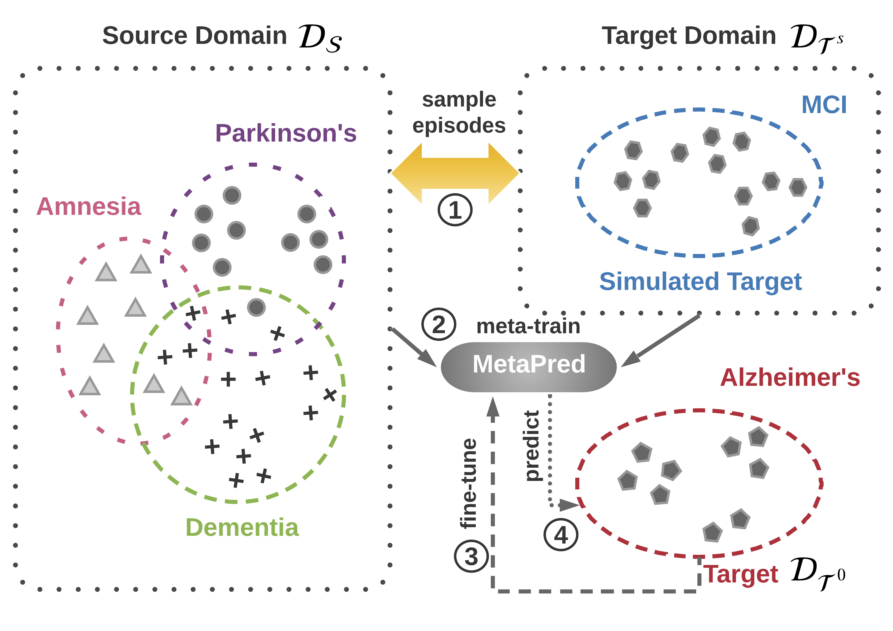
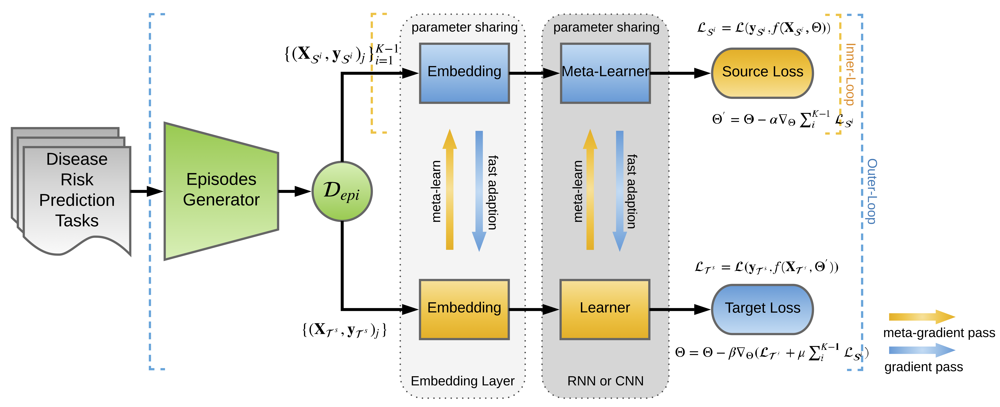
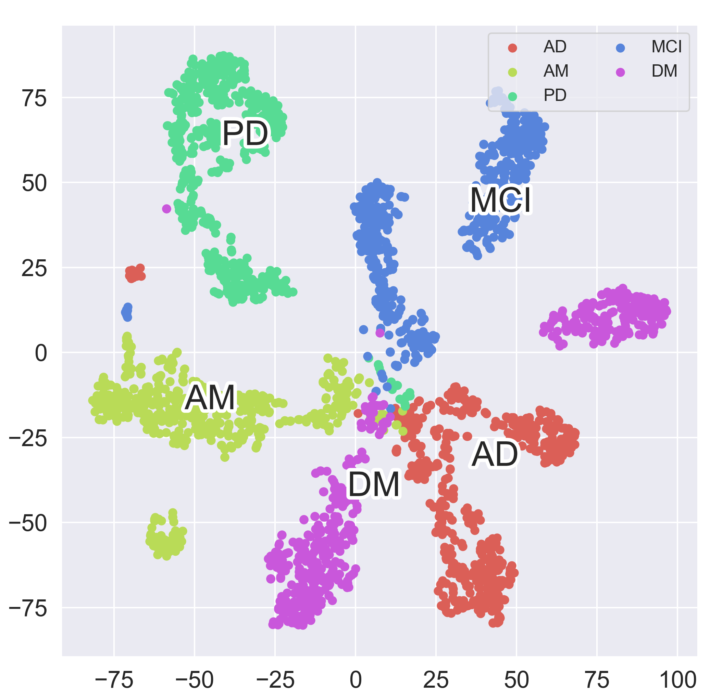

# MetaPred
The repo is code (baseline and the proposed MetaPred) for paper MetaPred: Meta-Learning for Clinical Risk Prediction with Limited Patient Electronic Health Records by [Xi Sheryl Zhang](https://www.xi-zhang.net), [Fengyi Tang](https://github.com/af1tang), [Hiroko H. Dodge](https://medicine.umich.edu/dept/neurology/hiroko-dodge-phd), [Jiayu Zhou](https://jiayuzhou.github.io), and [Fei Wang](https://sites.google.com/site/cornellwanglab/home).  

## Overview

MetaPred is a meta-learning framework for Clinical Risk Prediction using limited patient Electronic Health Records (EHRs). We given an example in the following figure:

<p align="center"></p>

Suppose we have multiple domains, our goal is to predict Alzheimer’s disease with few labeled patients, which give rise to a low-resource classification. The idea is to employ labeled patients from high-resource domains and design a learning to transfer framework with sources and a simulated target in meta-learning. There are four steps: (1) constructing episodes by sampling from the source domains and the simulated target domain; (2) learn the parameters of predictors in an episode-by-episode manner; (3) fine-tuning the model parameters on the genuine target domain; (4) predicting the target clinical risk. We respectively implemented Convolutional Neural Network (CNN) and Long-Shot Term Memory (LSTM) Network as base predictors. The model overview (meta-training procedure) is shown as follows:

<p align="center"></p>

The entire learning procedure can be viewed as: iteratively transfer the parameter Θ learned from source domains through utilizing it as the initialization of the parameter that needs to be updated in the target domain.

## Results

The learned representations of patients in five disease domains are visualized by t-SNE. In detail, AD, PD, DM, AM, MCI are abbreviations of Alzheimer's Disease, Parkinson's Disease, Dementia, Amnesia and Mild Cognitive Impairment, respectively. As a patient might suffer multiple diseases, there is supposed to be some overlaps among the given domains.

<p align="center"></p>

To demonstrate the effectiveness of the proposed MetaPred in the context of domain adaptation, we compare it with the state-of-the-art meta-learning algorithm ``Model-Agnostic Meta-Learning for Fast Adaptation of Deep Networks`` (MAML). The results on Alzheimer's Disease domain are presented in terms of AUC and F1-Score.

<p align="center"></p>


## Requirements
This package has the following requirements:
* `Python 3.x`
* [TensorFlow 1.5](https://github.com/tensorflow/tensorflow)
* [Progress Bar](https://progressbar-2.readthedocs.io/en/latest/index.html)


## Usage
### Baseline in Sequential Data Modeling 
The [baseline implementation](https://github.com/sheryl-ai/MetaPred/tree/master/baselines) includes:
* Logistic Regression
* K-Nearest Neighbors 
* XGBoost 
* SVM
* Random Forest
* MLP
* LSTM
* CNN

which can be used in any sort of sequence modeling, especially for EHRs data, directly.

### How to Run
To run MetaPred on EHR data, you need to revise the learning settings in main.py and the network hyperparameters in model.py. Then run the shell script metapred.sh.
```bash
bash metapred.sh
```
Our settings of learning procedures are:
```bash
python main.py --method='cnn' --metatrain_iterations=10000 --meta_batch_size=32 --update_batch_size=4 --meta_lr=0.001 --update_lr=1e-5 --num_updates=4 --n_total_batches=500000
```
or
```bash
python main.py --method='rnn' --metatrain_iterations=10000 --meta_batch_size=32 --update_batch_size=4 --meta_lr=0.001 --update_lr=1e-5 --num_updates=4 --n_total_batches=500000
```

### Additional Material
There is implementations used in:

Chelsea Finn, Pieter Abbeel, Sergey Levine, [Model-Agnostic Meta-Learning for Fast Adaptation of Deep Networks](https://arxiv.org/abs/1703.03400), International Conference on Machine Learning (ICML), 2017.

## References 
If you happen to use our work, please consider citing our paper: 
```
@inproceedings{Zhang:2019:MMC:3292500.3330779,
 author = {Zhang, Xi Sheryl and Tang, Fengyi and Dodge, Hiroko H. and Zhou, Jiayu and Wang, Fei},
 title = {MetaPred: Meta-Learning for Clinical Risk Prediction with Limited Patient Electronic Health Records},
 booktitle = {Proceedings of the 25th ACM SIGKDD International Conference on Knowledge Discovery \& Data Mining},
 series = {KDD '19},
 year = {2019},
 location = {Anchorage, AK, USA},
 pages = {2487--2495},
} 
```
This paper can be accessed on : [MetaPred] (https://dl.acm.org/citation.cfm?id=3330779)

